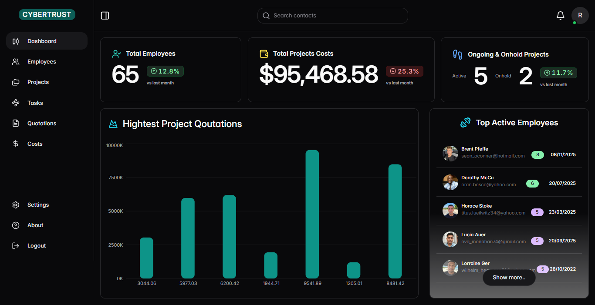

# Cyber-Trust MS

#### 📸 Dashboard



## Overview
Cyber-Trust MS is a compact TypeScript monorepo demonstrating a full-stack dashboard app.
It pairs a React + Chakra UI frontend with an Express + Mongoose backend and uses Bun as the runtime/package manager.

Features include role-based access control (Admin, Manager, Developer), modular UI components, and optional seeded data for development.

---

## Tech stack
- Bun (runtime & package manager)
- Frontend: React, Chakra UI, React Query, Zustand, Axios
- Backend: Node.js (via Bun), Express, MongoDB + Mongoose
- Seed: Faker.js
- Language: TypeScript

---

## Project structure (high level)
```
root/
├─ index.ts
├─ package.json        # workspace config
├─ README.md
├─ tsconfig.json
└─ packages/
   ├─ client/          # React + Chakra UI frontend
   │  └─ src/
   └─ server/          # Express + Mongoose backend
      └─ src/
```

---

## Features
- Role-based access control (Admin, Manager, Developer)
- Dashboard modules: Employees, Projects, Tasks, Costs, Quotations
- JWT auth with refresh handled via Axios interceptors
- Optional `/seed` endpoint to populate development data with Faker.js

---

## Quick start
1. Clone the repository
```powershell
git clone https://github.com/your-username/cyber-trust-ms.git
cd cybertrust-ms
```
2. Install dependencies
```powershell
bun install
```
3. Run development servers (client + server)
```powershell
bun dev
# or
bun run dev
```

## Environment
- Copy `packages/server/env.example` to `packages/server/.env` and fill in required values (MongoDB URI, JWT secrets, ports).
- If the client requires environment variables, copy `packages/client/env.example` to `packages/client/.env`.

## Seed data (optional)
- If the server's `/seed` endpoint is enabled, visit `http://localhost:5000/seed` to populate MongoDB with sample data.

---

## Contributing
Contributions are welcome. Suggested flow:

1. Fork the repo
2. Create a feature branch: `git checkout -b feature/your-feature`
3. Commit with clear messages: `git commit -m "Add feature"`
4. Push and open a pull request

Guidelines:
- Use TypeScript
- Follow RESTful API conventions
- Keep components modular and reusable

---

## License
MIT — free to use, modify, and distribute.
### 4. Environment variables

Create a .env file in packages/server/ with


nvironment variables

Create a .env file in packages/server/ and copy name from env.example i created in server and client.


